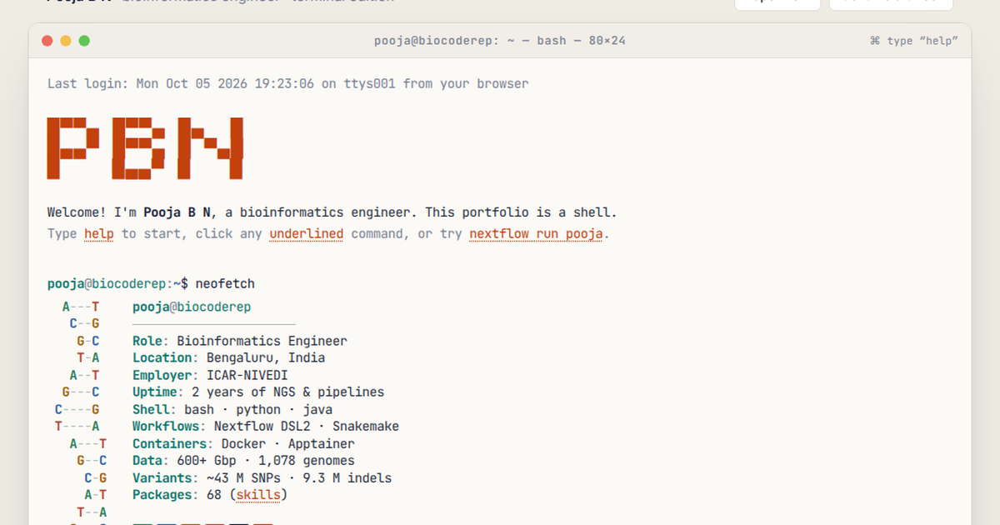

<a href="https://biocoderep.github.io">
  __Open_my_Portfolio-biocoderep.github.io-1a2238?style=for-the-badge" alt="Open my Portfolio" height="44">
</a>

  

## Hi, I'm Pooja 👋

**Bioinformatics Engineer** · NGS & pathogen genomics · Workflow development · Bengaluru, India

I build reproducible pipelines for bacterial and viral genomics: from raw Illumina / Nanopore reads to variants, assemblies, AMR profiles and phylogenies. I currently work at **ICAR-NIVEDI**.

---

### 🔬 Highlights
- Processed **600+ Gbp** of sequencing data across **1,078 genomes** and called **~43 M SNPs**
- Built a bacterial genomics HPC workflow covering **468 genomes from 33 countries**
- Developed **4 research tools** that the team uses every day

### 🛠️ Selected projects
| Project | What it does | Stack |
|---|---|---|
| **PathoGVI** | Scores pathogen alignments on 9 genomic indices and combines them into a traceable virulence index (CLI + web) | Java · Maven · Docker |
| **VetGenomeHub** | Browser platform for Nanopore QC, assembly, variant calling and AMR, with no terminal needed. Includes MGE-SIFT for AMR genes on mobile elements | Python · FastAPI · Nextflow · Apptainer |
| **G4-WATCH** | G-quadruplex surveillance framework for 13 livestock viruses, with 1,322 tests and 12 Docker images | Python · Docker · CI/CD |

### 🧰 Tech stack

**Bio tools:** BWA-MEM · minimap2 · GATK · BCFtools · Clair3 · SPAdes · Flye · Medaka · AMRFinderPlus · CARD/RGI · IQ-TREE · MAFFT · Kraken2
